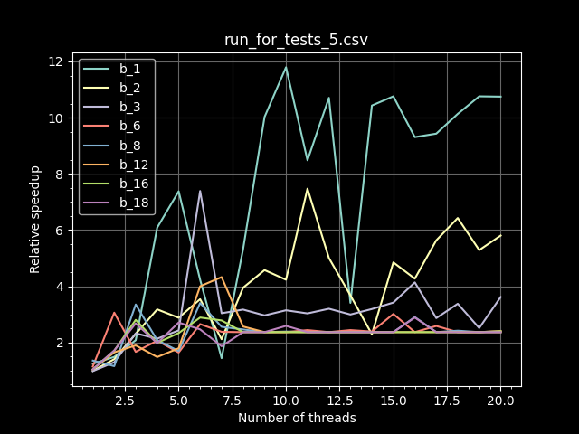

# Notes on multithreading in Cervo

## Introduction

Both `run` and `run_for` can be run in threaded mode by enabling the `threaded` feature for `cervo-runtime`. This is done with the help of rayon.
For `run_threaded()`, all models that need to be executed are being run, while `run_for_threaded()` first prepares the models that need to be executed in advance on a single thread, and then iterates over them until `duration` has expired.

## Benchmarking

Relative speedup is measured by comparing single threaded runs with multithreaded ones. Benchmarking is over different batch sizes (marked `b_<num>` in the graphs). 

Three onnx models are tested, a small MLP (`test.onnx`) and two larger ones (`test-complex.onnx` and `test-large.onnx`). Different repetitions are also tested, meaning that 1 repetition is those 3 brains once, while 5 repetitions is 5 brains each, with 15 brains total.

Measuring speedup for one-shot runs `run_threaded()` is relatively straightforward: Time both threaded and single threaded and compute speedup:

1 Reps One Shot | 2 Reps One Shot  
:-------------------------:|:-------------------------:
  |  

5 Reps One Shot | 10 Reps One Shot  
:-------------------------:|:-------------------------:
  |  

However, measuring `run_for()` is more complex, as a duration needs to be given. This duration is determined by getting the time it takes to run the current batch size and brains in one-shot `run()` in single-threaded mode. The amount of results for both threaded and single are then compared to establish relative speedup.

When running brains of strongly varying sizes, as the ones described above, a lot of variance is obtained:

5 Reps Timed | 10 Reps Timed | 15 Reps Timed
:-------------------------:|:-------------------------:|:-------------------------:
  |   | 

The `run_for()` method will attempt to greedily run as many brains as it can fit in during a given time period. However, this means that over many runs, there will be a bias to run smaller models, as those can be best fit into a limited duration. The runs listed above are averages over many runs, and the difference in model composition over run explains the high variance observed.

When using brains of similar sizes, less variance is observed:

5 Reps Timed | 10 Reps Timed | 15 Reps Timed
:-------------------------:|:-------------------------:|:-------------------------:
  |   | 

In those runs, the speedup is more consistent. For the 5 rep run, the speedup caps out after a while, as there are not enough brains to be run.
